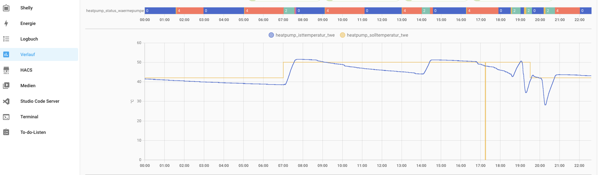

# Integration of Kermi x-center or Heizbösch heatpump with Home.Assistant

__This integration requires Modbus activated on your heatpump device.__
Please contact [Kermi](https://www.kermi.com/) or [Heizbösch](https://www.boesch.at/) support to get it activated.

Official Information Page: [Loxone Library - Bösch MOZART/KLIMT-RW60 Heating & Cooling](https://library.loxone.com/detail/kermi-heating-cooling-1587/overview)

## Basic Integration

In Home.Assistant everything is an [Entity](https://developers.home-assistant.io/docs/architecture/devices-and-services).

To  integration  the heatpump we contribute different entity types. 
* [Sensor](https://developers.home-assistant.io/docs/core/entity/sensor/) elements that give us different state values (some of them writable), 
* `template` that form new entities based on `sensor` entities (e.g. to perform a calculation)
* `automation` to perform tasks on entities

### Modbus

Home.Assistant connects to the heatpump using [Modbus TCP](https://en.wikipedia.org/wiki/Modbus), the basic configuration
is by adding the enclosed `heatpump-modbus.yaml` to the main `configuration.yaml` via

```
modbus: !include modbus.yaml
```

I have a [Kermi dynamic pro M] [Mozart 13 AC RW60 model](https://www.boesch.at/produkte/heizen/waermepumpe/luft/modulierende-luft-wasser-waermepumpe-mozart13ac-rw60~495484), which is 
why the basic modbus name is `mozart13acrw60_hub`. You have to adapt the
IP address, the rest should be good to go.

With the included `heatpump-modbus-sensors.yaml` and a restart of Home.Assistant you should be already capable of reading out some values like the temperature of your drinking water storage.



### Templates

Some values are in an uncommon format, and we want to add an additional entity to convert them into the format we need them. This is done using `template` entities.

Same again for `configuration.yaml`
```
template: !include heatpump-templates.yaml
```

## Advanced Integration

After implementing the read only values we want to make proper usage of
the interface, and reach even beyond. The following topics will cover how to control the heatpump by modifying the set values, how to add a proper Home.Assistant dashboard, and how to configure an affordable real world display.

### Modifying values

WIP

* Parallel-Shift
* Activate/Deactivate Drinking Water Heating

### Dashboards

WIP

### Shelly Wall-Display

WIP

## Future Projects

* SCOP Wert berechnen (jährlich)
* SEER Wert berechnen (jährlich)
* Laufende COP-Kennlinie (Verbindung Aussentemperatur <-> COP) [TWE, Heizung]
* Intelligente Legionellenschaltung (Time since last twe temp > 60°C)
  * Problem keine Szenensteuerung über Modbus möglich
* Display mit "Wie finden Sie die Temperatur?" Zu kalt - Passt genau - Zu Warm

#### Notes

some random notes

```
x: TWE Temperatur
y: Aussentemperatur
v: COP min - max
One file from 1.7.xx-30.6.xx+1
(40.3, 5.2) = {5.5, 6.5}
```


Darf ich die Busdaten auf der GitHub Seite veröffentlichen?


## Others / Interesting Links / Notes

* https://www.home-assistant.li/cop-wert-waermepumpe-berechnen/
* https://husdata.se/docs/h60-manual/home-assistant-integration/


